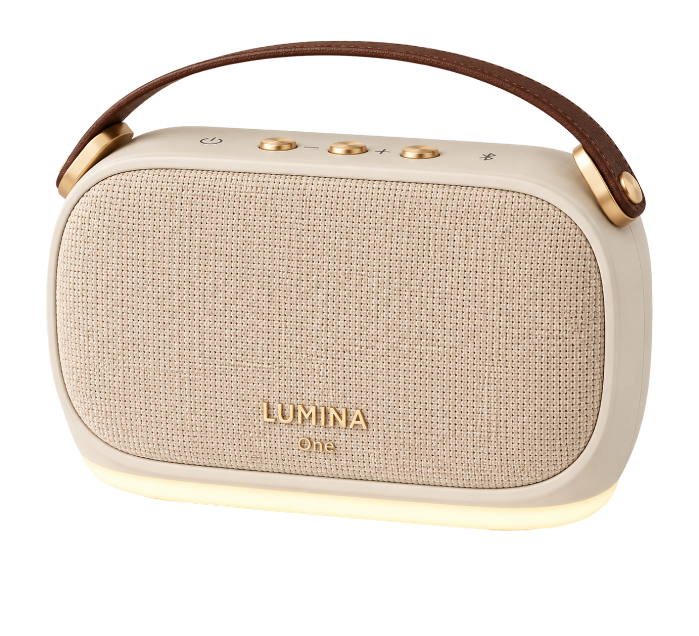
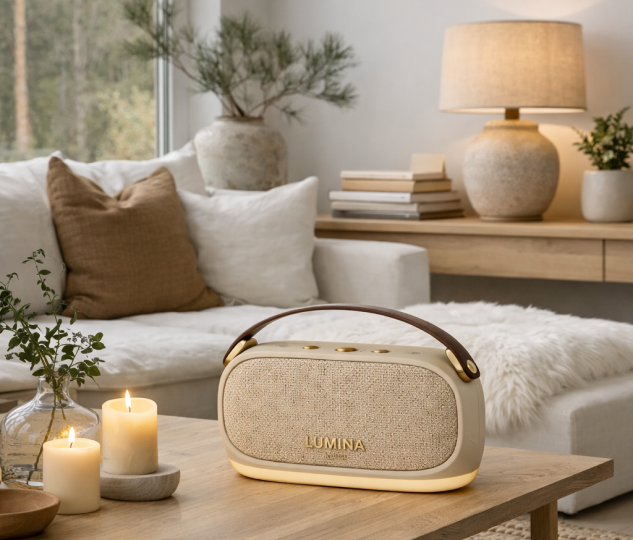
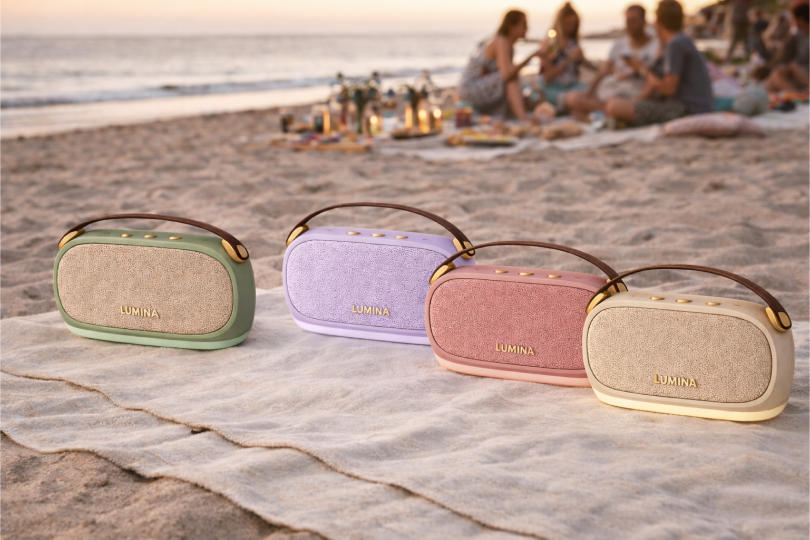
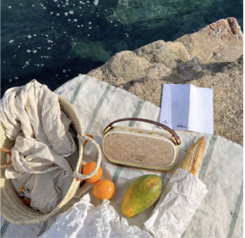
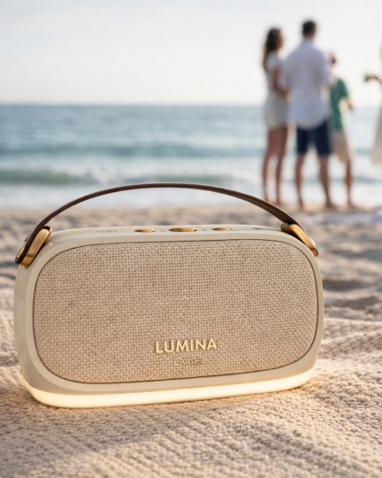
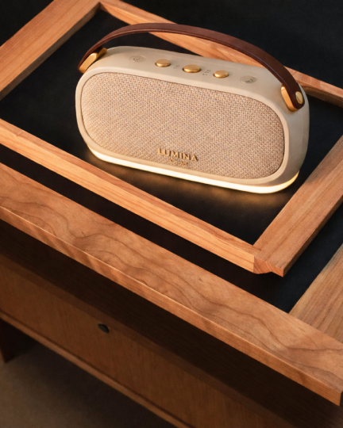
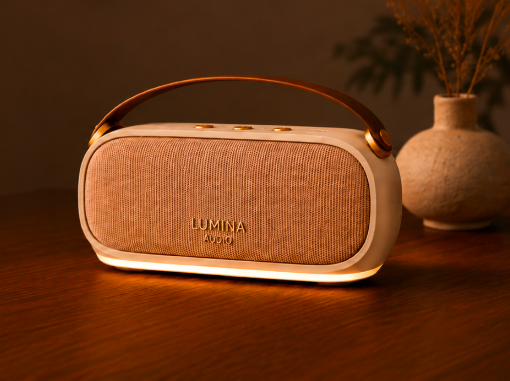

# Programmerings-dokumentation

## Kort beskrivelse af projektet

### Hvad er formålet med projektet?
Formålet med projektet er at lave en landing page for Lumina Audio, hvor produktet LUMINA One bliver præsenteret på en æstetisk, overskuelig og brugervenlig måde, som stadig passer til personaen.

Projektet har fokus på at optimere den tidligere udgave ved at arbejde med UX/UI-principper. Derudover arbejdes der også med programmering, hvor JavaScript skal implementeres, samt med forbedringer af kodens struktur og opbygning.

### Hvilke teknologier har du brugt?
**HTML:**
Til at opbygge sidens struktur og indhold, fx header, navigation, hero-section, produktsektion, Trustpilot/anmeldelser og footer.

**CSS:**
Til at style siden visuelt, fx farver, typografi, layout, afstande, hover-effekter og placering af billeder.

**JavaScript:**
Til at gøre siden mere interaktiv, fx ved at brugeren kan skifte produktbillede ved valg af farve, og ved at lave en auto-scroll-sektion med billeder.

**GitHub og GitHub Pages:**
Til at gemme koden online og publicere projektet, så siden kan ses via et link.
### Hvad kan brugeren gøre på siden?
Brugeren skal kunne se og læse om produktet LUMINA One samt forstå, hvilke muligheder der er med netop denne højtaler. Brugeren skal få interesse for produktet og gennem hele beslutnings- og købsprocessen føle sig tryg.

### Hvilken type data arbejder projektet med?
Projektet arbejder med statisk data i HTML, såsom overskrifter, brødtekst, produktinformation, links, anmeldelser og informationer i footeren. Der er også tilføjet interaktive elementer ved brug af JavaScript, eksempelvis på produktkortet og i auto-scroll-sektionen.

## Fil- og mappestruktur
### Hvad indeholder din html-fil?
Min HTML-fil indeholder selve strukturen og indholdet på hjemmesiden.
HTML filen er hjemmesidens byggeklodser.

### Hvad bruges din css-mappe til?
CSS-mappen indholder en CSS-fil, som bruges til at styrer design og styling på hjemmesiden. I min CSS har jeg fokuserede på at skabe lyse baggrundsfarver, mørk tekst, store billeder og luft mellem elementerne.


### Hvad bruges din js-mappe til?
Min js-mappe bruges til at samle de JavaScript-filer, der styrer interaktionen på hjemmesiden. JavaScript gør siden mere dynamisk og interaktiv. Jeg bruger Javascript til, at skifte produktbillede, når brugeren vælger en farve og i auto-scroll sektion, som viser billederne.

### Hvor ligger dine billeder?
Alle billederne ligger i en img-mappe, hvor de er samlet

### Hvorfor har du valgt denne struktur?
Jeg benytter mig af denne mappe- og filstruktur, da det er den vi har lært i undervisningen, og jeg derfor ved den fungerer.

## Validering
### HTML
Jeg havde nogle fejl i min HTML validering. Fejlene omhandlede mine overskrifter. Jeg ændrede disse fejl ved at skabe en sammenhæng mellem overskrifterne, så der er et hierarki og de passer sammen.

### CSS

## Programmerings eksempler
### Trustpilot sektionen
Formålet med denne sektion er at skabe social proof, så brugerne føler sig i købsprocessen. 

#### HTML
I HTML sektionen har jeg delt sektionen op i klasser, hvor jeg bl.a. har en klasse til hele sektio-nen, venstre siden med samlede score og trustpilot logo, samt en højre side med anmeldel-serne, og endnu flere klasser som hjælper mig med at style de rigtige dele hver for sig. Jeg tilfø-jer også et link og logo til strukturen.
#### CSS
I min CSS styler jeg først hele sektionen med display:flex og align-items-center, dernæst styler jeg venstre side. Efter venstre side styler jeg den højre, hvor jeg bruger flex:1, som giver lov til at den højre side må fylde resten af pladsen. Jeg styler anmeldelseskortene, med elementerne inden i. Jeg tilføjer en styling til linket, samt logoet og tilslut en pil.
```html
<section class="trustpilot-section">
<!-- Venstre side: samlet Trustpilot-score -->
  <div class="trustpilot-summary">

      <!-- Trustpilot-logo/overskrift -->
      <div class="trustpilot-logo">
        
      </div>

    <!-- De grønne stjerner -->
      <div class="trust-stars">
        
      </div>

    <!-- Den samlede score -->
      <p class="trust-score">4,8/5</p>

    <!-- Lille tekst under scoren -->
      <p class="trust-reviews">Baseret på 327 anmeldelser</p>

  </div>

<!-- Højre side: området med anmeldelseskort -->
  <div class="review-area">

    <!-- Wrapper der holder alle anmeldelseskortene ved siden af hinanden -->
    <div class="review-grid">
      
      <!-- Én anmeldelse -->
        <article class="review-card">
        <!-- Toppen af kortet med bruger og navn -->
          <div class="review-header">
            <div class="bruger">
              
              </div>
              <div>
                <h3>Mia S.</h3>
                <p>København</p>
              </div>
            </div>

        <!-- Stjerner i anmeldelsen -->
              

        <!-- Selve anmeldelsesteksten -->
              <p class="review-text"> “Virkelig overrasket over hvor høj og klar lyden er – selv udendørs!”</p>

            <!-- Dato for anmeldelsen -->
              <p class="review-date">2 dage siden</p>
        </article>


        <!-- anden anmeldelse -->
        <article class="review-card">
                        
        <!-- Toppen af kortet med bruger og navn -->
            <div class="review-header">
              <div class="bruger">
                
              </div>
              <div>
                <h3>Clara W.</h3>
                <p>Odense</p>
              </div>
            </div>
        <!-- Stjerner i anmeldelsen -->
              

        <!-- Selve anmeldelsesteksten -->
                <p class="review-text">“Brugte den til camping, og den klarede både regn og mudder.“</p>
                <!-- Dato for anmeldelsen -->
                    <p class="review-date">5 dage siden</p>
        </article>


          <!-- tredje anmeldelse -->
          <article class="review-card">
                        
          <!-- Toppen af kortet med bruger og navn -->
              <div class="review-header">
                <div class="bruger">
                  
                </div>
                <div>
                  <h3>Emil H.</h3>
                  <p>Aalborg</p>
                </div>
              </div>
          <!-- Stjerner i anmeldelsen -->
              

          <!-- Selve anmeldelsesteksten -->
                <p class="review-text">“Elsker LED-indikatoren - USB-C opladning er bare praktisk.“</p>
          <!-- Dato for anmeldelsen -->
                <p class="review-date">1 uge siden</p>
            </article>
      </div>
            
            <!-- link til trustpilot -->
              <div class="trustpilot-link-wrapper">
    <a href="https://dk.trustpilot.com/" class="trustpilot-link">
      Se alle anmeldelser på 
      
    </a>
  </div>
  </div>
</section>
```

```css
/* Hele Trustpilot-sektionen */
    .trustpilot-section {
    display: flex;
    align-items: center;
    gap: 80px;
    padding: 80px 120px;
    background-color: var(--lightbackground-color);
    }

/* Venstre side med Trustpilot-score */
    .trustpilot-summary {
    width: 320px;
    text-align: center;
    }

/* Trustpilot-logo */
    .trustpilot-logo img {
    width: 210px;
    margin-bottom: 18px;
    }

/* De store grønne Trustpilot-stjerner */
    .trust-stars img {
    width: 310px;
    height: auto;
    margin-bottom: 24px;
    }

/* Stor score: 4,8/5 */
    .trust-score {
    font-family: "Inria Sans", sans-serif;
    font-size: 64px;
    font-weight: 500;
    margin: 0 0 16px 0;
    line-height: 1;
    }

/* Tekst under score */
    .trust-reviews {
    font-size: 16px;
    margin: 0;
    }

/* Højre side med anmeldelser */
    .review-area {
    flex: 1;
    }

/* Holder anmeldelseskortene ved siden af hinanden */
    .review-grid {
    display: flex;
    gap: 36px;
    justify-content: center;
    }

/* Selve anmeldelseskortet */
    .review-card {
    width: 270px;
    min-height: 260px;
    padding: 24px;
    border: 1px solid #908679;
    border-radius: 8px;
    background-color: transparent;
    display: flex;
    flex-direction: column;
    }

/* Toppen af kortet med profilbillede og navn */
    .review-header {
    display: flex;
    align-items: center;
    gap: 12px;
    margin-bottom: 16px;
    }

/* Profilbillede */
    .bruger img {
    width: 48px;
    height: 48px;
    }

/* Navn */
    .review-header h3 {
    font-size: 16px;
    margin: 0;
    font-weight: 600;
    }

/* By */
    .review-header p {
    font-size: 13px;
    margin: 2px 0 0 0;
    }

/* Stjerner inde i anmeldelsen */
    .review-stars {
    height: 20px;
    width: auto;
    max-width: 130px;
    object-fit: contain;
    margin-bottom: 18px;
    align-self: flex-start;
    }

/* Anmeldelsestekst */
    .review-text {
    font-size: 15px;
    line-height: 1.7;
    margin: 0;
    }

/* Dato nederst */
    .review-date {
    font-size: 14px;
    margin-top: auto;
    padding-top: 40px;
    }

/* Link nederst */
    .trustpilot-link {
    display: flex;
    justify-content: center;
    align-items: center;
    gap: 10px;
    margin-top: 40px;
    color: black;
    text-decoration: none;
    font-size: 16px;
    }

/* Trustpilot-logo i linket */
    .trustpilot-link img {
    width: 150px;
    }

/* Pil efter linket */
    .trustpilot-link:after {
    content: "→";
    font-size: 28px;
    margin-left: 8px;
    }
```

### Produktsektion med farvevælger
Formålet med denne sektion er at informere brugeren om produktet, pris og farver, samt give mulighed og lyst til at bruge CTA-knapperne og i sidste ende foretage et køb.
#### HTML 
Jeg har i HTML strukturen lavet sektionen med et id og en klasse, hvor klasse bruges til styling og id’et til JavaScript. Jeg har delt sektionen op i venstre side, med produkt billede, og højre side med tekst, pris, farvevælger og CTA-knapper. Jeg har brugt form-tag, da det oftest bruges når bruger kan vælge noget, i dette tilfælde farven. Jeg har brugt fieldset, som samler knapper-ne. Hver knap kan have tre klasser, ”color-option”, ”farven på knappen” og ”active”. Tilslut i denne sektion har jeg et nav-tag med klassen "product-actions", hvor mine CTA-knapper ligger. 
#### CSS
I min CSS har jeg stylede alle klasserne, først hele sektionen med baggrundsfarve og padding. Jeg har brugt display: flex, så det er nemmere at placere indholdet, samt centreret det lodret. 
I klasserne med højre side og venstre side har jeg brugt flex:1, da siderne så deles om pladsen. Jeg har ladet billede fylde hele angivende plads med display:block. 
Ved CTA-knapperne bruger jeg display: inline-flex, så de kun fylder det de har brug for, men indholdet stadig kan styles. Jeg har tilføjet hoover, med en transition på 0.3s ease, så det sker i en glidende bevægelse. Farveknapperne har også hoover med en glidende bevægelse, samt en transform på 1.08, så de forstørges med 8%. Derudover har de en outline-offset: 4px, så der er mellemrum mellem knappen og kanten omkring.
#### Javascript
I HTML har jeg alle værdierne, derfor henter jeg produktbillede og farveknapperne ved brug af que-ryselector. Herefter tilføjer jeg et loop, hvor js gennemgår en farveknap ad gangen og tilføjer klik event indtil alle farveknapper har en klikevent. Så tilføjes en event listener, som lytter når der sker klik, skal funktionen køres. Først henter funktionen billedet og teksten som passer til efter skiftes billedet og alt teksten. Efter bruger jeg for… of, som vælger alle elementerne, og fjerner aktive så knapperne ikke er markeret. Til sidst i funktion tilføjer js markering til den valgte knap.
```html
<section id="produkt" class="product">
  <figure class="product-left">
    
  </figure>

  <article class="product-right">
    <h4>LUMINA One</h4>
        <p>
        Stor lyd og stemning – hvor end du er. LUMINA One leverer 100 dB,
        18 timers batteri og stemningslys i et let, vandafvisende design
        med Bluetooth 5.3 og Social Connect.
        </p>
   <!-- form = bruges normalt, når brugeren skal vælge eller indtaste noget-->
  <form class="product-colors">
    <!-- <fieldset> samler flere valg, der hører sammen. -->
    <fieldset>
        <!-- <legend> er overskriften til <fieldset>. -->
      <legend>Vælg farve:</legend>

      <button
      class="color-option beige active"
      type="button"
      aria-label="Vælg beige"
      data-image="img/lumina-beige.png"
      data-alt="Lumina One i beige">
      </button>

      <button
      class="color-option green"
      type="button"
      aria-label="Vælg grøn"
      data-image="img/lumina-green.png"
      data-alt="Lumina One i grøn">
      </button>

      <button
      class="color-option purple"
      type="button"
      aria-label="Vælg lilla"
      data-image="img/lumina-purple.png"
      data-alt="Lumina One i lilla">
      </button>

      <button
      class="color-option pink"
      type="button"
      aria-label="Vælg pink"
      data-image="img/lumina-pink.png"
      data-alt="Lumina One i pink">
      </button>
    </fieldset>
  </form>
        <p class="price">1.499 DKK</p>
    <nav class="product-actions">
        <a href="#" class="btn-product">Køb nu</a>
        <a href="#" class="btn-product-secondary">Se specifikationer →</a>
    </nav>
  </article>
</section>
```

```css
  /* styling af produkt kort */
  .product {
  background-color: var(--lightbackground-color);
  padding: 80px 100px;
  display: flex;
  align-items: center;
  justify-content: center;
  gap: 80px;
  }

   /* venstre side med produktbillede */
  .product-left {
    flex: 1;
    margin: 0;
    display: flex;
    justify-content: center;
    align-items: center;
  } 

  /* billede str. */
  .product-left img {
    width: 100%;
    max-width: 480px;
    height: auto;
    display: block;
  }

  /* styling af h4 */
   .product-right h4 {
    font-family: 'Poppins', sans-serif;
    font-size: 22px;
    font-weight: 500;
    margin: 0 0 20px 0;
   }

   /* styling af p */
   .product-right p {
    font-family: 'Poppins', sans-serif;
    font-size: 18px;
    font-weight: 300;
     line-height: 1.8;
    margin: 0 0 24px 0;
    max-width: 600px;
   }

    /* pris */
  .product-right .price {
  font-size: 24px;
  font-weight: 500;
  margin-bottom: 32px;
  }

  /* produktknapper */
  .product-actions {
  display: flex;
  gap: 16px;
  margin-top: 32px;
  flex-wrap: wrap;
  }

   /* fælles styling for begge produktknapper */
  .btn-product,
  .btn-product-secondary {
    display: inline-flex;
    align-items: center;
    justify-content: center;

    min-width: 190px;
    padding: 18px 34px;
    border-radius: 12px;

    font-family: 'Poppins', sans-serif;
    font-size: 18px;
    font-weight: 400;
    letter-spacing: 2px;

    text-decoration: none;
    cursor: pointer;
    transition: 0.3s ease;
  }

  /* køb knap */
  .btn-product {
  background-color: #C89B5C;
  color: black;
  border: 1px solid #C89B5C;
  }

  /* sekundær knap */
  .btn-product-secondary {
    background-color: transparent;
    color: black;
    border: 1px solid #C89B5C;
  }

  /* hover-effekter */
.btn-product:hover {
  background-color: #D8AD70;
}

.btn-product-secondary:hover {
  background-color: var(--darkbackground-color);
  color: black;
}

/* styling af farve knappers placering*/
  .product-colors fieldset {
    border: none;
    padding: 0;
    margin: 24px 0;
    display: flex;
    align-items: center;
    gap: 24px;
    flex-wrap: wrap;
  }

  /* overskrift til farvevalg */
.product-colors legend {
  font-family: 'Poppins', sans-serif;
  font-size: 20px;
  font-weight: 300;
  margin-bottom: 12px;
  width: 100%;
  }

    /* styling af farve knappers størrelse*/
  .color-option {
    width: 48px;
    height: 48px;
    border-radius: 50%;
    border: 2px solid var(--darkbackground-color);
    cursor: pointer;
    padding: 0;
    appearance: none;
    transition: 0.2s ease;
  }

  .color-option.active {
  outline: 2px solid #C89B5C;
  outline-offset: 4px;
}

    .beige {
    background-color: #D8C5A5;
  }

  .green {
    background-color: #879987;
  }

  .purple {
    background-color: #D0BEE5;
  }

  .pink {
    background-color: #E0A89F;
  }

  .color-option:hover {
    transform: scale(1.08);
  }
```

``` javascript
// Finder produktbilledet
const productImage = document.querySelector("#product-image");

// Finder alle farveknapperne
const colorButtons = document.querySelectorAll(".color-option");

// gennemgår alle farveknapper igennem
for (const button of colorButtons) {
  button.addEventListener("click", function () {
    // Henter billedet fra data-image i HTML
    const newImage = button.dataset.image;

    
// Henter alt-teksten fra data-alt i HTML
    const newAlt = button.dataset.alt;

// Skifter produktbilledet
    productImage.src = newImage;

// Skifter alt-teksten
    productImage.alt = newAlt;

// Fjerner active fra alle farveknapper
    for (const colorButton of colorButtons) {
      colorButton.classList.remove("active");
    }

// Tilføjer active til den knap, brugeren klikkede på
    button.classList.add("active");
  });
}
```
### Auto-scroll på billedesektionen
Formålet med denne sektion er at skabe en mere dynamisk og visuelt interessant landingpage. Sektionen viserser flere produkt- og stemnings billeder uden brugeren selv skal gøre noget.
#### HTML
HTML-strukturen i denne sektion er meget enkel, da den består af en liste med billeder.
#### CSS
I stylingen starter jeg med at bruge overflow: hidden, så man kun ser billederne i sektionens brede. Så fjerner jeg punkterne fra listen, bruger display: flex så de nemmer styles ved siden af hinanden. Så bruger jeg width: max-content, så rækken matcher indholdet af billeder. Heref-terr tilføjer animation: autoScroll 40s linear infinite, som betyder at billederne tager 40 sekun-der at scroll, horisontalt og at det looper. Senere tilføjer jeg keyframes som laver selve animati-onen. Transform: translateX(0) er start positionen, transform: translateX(-50%), betyder flyt rækken 50% til venstre.
#### JavaScript
Jeg har brug js til at undgå hak i auto scroll-sektionen.
Først hentes hele listen med billeder, ved at bruge queryselector. Det gemmes i variablen ”ori-ginalImages”, som bruges til at kører billederne igennem to gange. Js kopierer billederne som giver en mere glidende bevægelse end ved kun at bruge CSS.
```html
<section class="img-loop">
    <ul class="img-track">
        <li>
            <figure>
                
            </figure>
        </li>

         <li>
            <figure>
                
            </figure>
        </li>

        <li>
            <figure>
                
            </figure>
        </li>

         <li>
            <figure>
                
            </figure>
        </li>

        <li>
            <figure>
                
            </figure>
        </li>

        <li>
            <figure>
                
            </figure>
        </li>
    </ul>
</section>
```

```css
/* styling af hele loop sektionen */
    .img-loop {
      /* overflow: hidden; viser kun billederne i sektionens bredde. */
      overflow: hidden;
      background-color: var(--lightbackground-color);
      padding: 40px 0;
    }

/* styler listen med billederne */
    .img-track {
    /* list-style: none; fjerner punkterne */
    list-style: none;
    margin: 0;
    padding: 0;

    display: flex;
    gap: 0px;
    /* width: max-content; gør rækken lige så bred som alt indholdet samlet. */
    width: max-content;
    animation: autoScroll 40s linear infinite;
    /* forberede sig på animationen */
    will-change: transform;
    }

/* styler hver liste */
    .img-track li {
    flex: 0 0 auto; /* betyder, at hvert billede beholder sin egen størrelse og ikke bliver mast sammen. */
    margin-right: 32px;
    }

/* styler alle "figure" */
    .img-track figure {
      margin: 0;
    }

/* styler billederne */
    .img-track img {
    height: 360px;
    width: 360px;
    object-fit: cover;
    display: block;
    }

/* @keyframes laver selve animationen. */
    @keyframes autoScroll {
    from {
      /* transform: translateX(0); betyder: start på normal position. */
      transform: translateX(0); 
    }
    to {
      /* transform: translateX(-50%); betyder: flyt rækken 50% mod venstre. js kopier billederne derfor undgår vi hak når den flytter 50% og starter forfra*/
       transform: translateX(-50%);
    }
    }
```

```javascript
// finder listen med billeder
const imageTrack = document.querySelector(".img-track");

// Gemmer alt indholdet inde i listen. Altså alle dine <li> med billeder.
const originalImages = imageTrack.innerHTML;

// Kopierer billederne og sætter dem ind én gang mere. den hakker ikke
imageTrack.innerHTML += originalImages;
```

